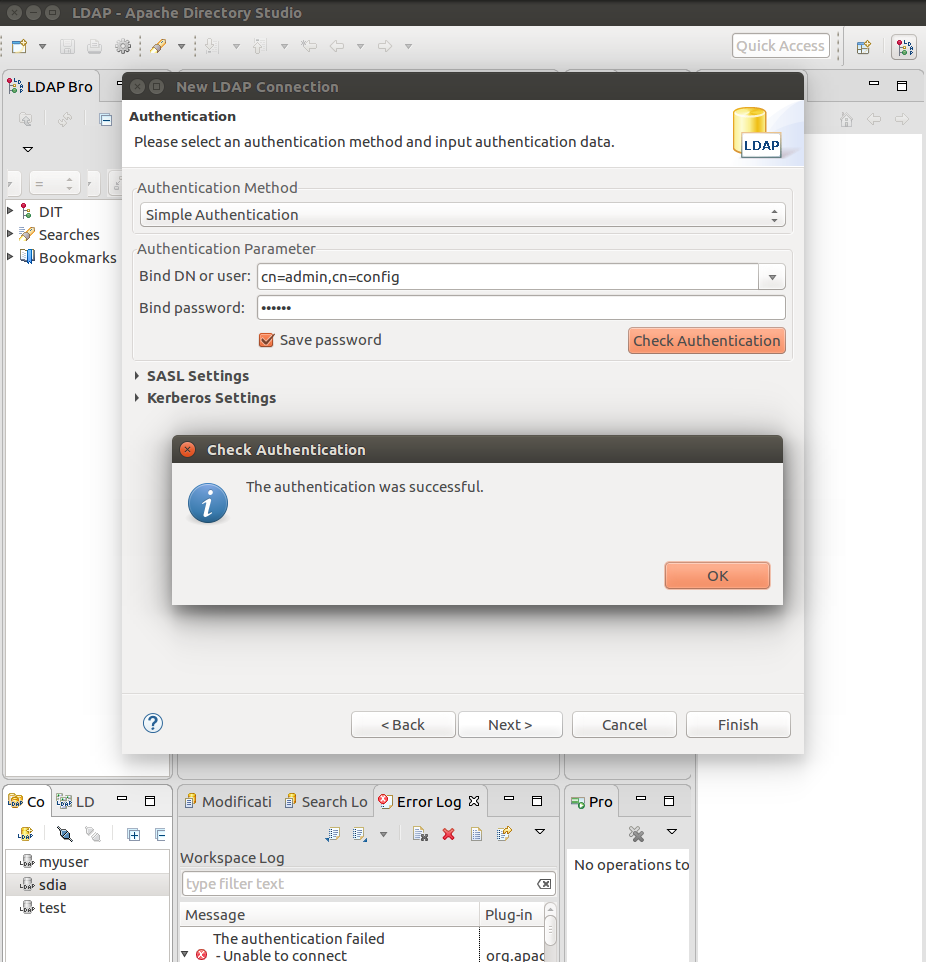
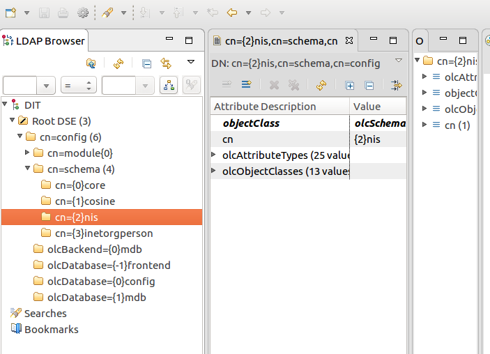
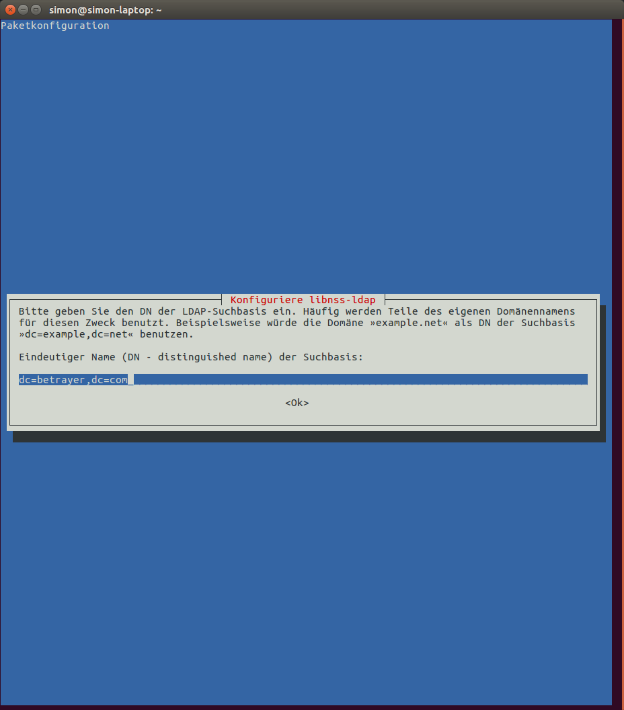
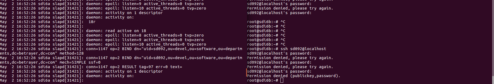
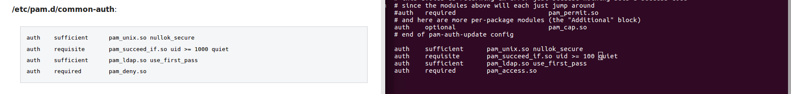
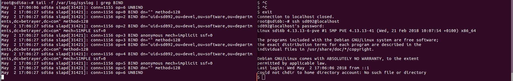

# Lecture  18. April


## Display Ldap Conf


```javascript
root@sdi6a:~# ldapsearch -Y EXTERNAL -H ldapi:/// -b cn=config

[...]

# {0}config, config
dn: olcDatabase={0}config,cn=config
objectClass: olcDatabaseConfig
olcDatabase: {0}config
olcAccess: {0}to * by dn.exact=gidNumber=0+uidNumber=0,cn=peercred,cn=external
 ,cn=auth manage by * break
olcRootDN: cn=admin,cn=config

# {1}mdb, config
dn: olcDatabase={1}mdb,cn=config
objectClass: olcDatabaseConfig
objectClass: olcMdbConfig
olcDatabase: {1}mdb
olcDbDirectory: /var/lib/ldap
olcSuffix: dc=betrayer,dc=com
olcAccess: {0}to attrs=userPassword by self write by anonymous auth by * none
olcAccess: {1}to attrs=shadowLastChange by self write by * read
olcAccess: {2}to * by * read
olcLastMod: TRUE
olcRootDN: cn=admin,dc=betrayer,dc=com
olcRootPW: {SSHA}pgGdrKB82F4QKuYrzJyxn9GF14AVw/Rz
olcDbCheckpoint: 512 30
olcDbIndex: objectClass eq
olcDbIndex: cn,uid eq
olcDbIndex: uidNumber,gidNumber eq
olcDbIndex: member,memberUid eq
olcDbMaxSize: 1073741824

[...]


```
We can see here that the main database has entries for login credentials. More specific:

```javascript
olcRootDN: cn=admin,dc=betrayer,dc=com
olcRootPW: {SSHA}pgGdrKB82F4QKuYrzJyxn9GF14AVw/Rz

```

Because they are written here, we can login in to change the main database with external tools like **Apache Directory Studio**. However, we cant change the ldap configuration since there are no credentials of the config db.

## How to add the login info to the config Database

1 Create Passwort Hash

```javascript
root@sdi6a:~# sl
slabtop     slapadd     slapcat     slapdn      slappasswd  slaptest    sleep       
slapacl     slapauth    slapd       slapindex   slapschema  slattach    slogin  

root@sdi6a:~# slappasswd
New password:
Re-enter new password:
{SSHA}IiUflyHsmgaEyjb2N/uEAWw2A2dvbfSi
```

  2 Create Ldap Modify Entry and activate

```javascript
root@sdi6a:~# nano ~/add_olcRootPW.ldif

root@sdi6a:~# cat ~/add_olcRootPW.ldif
dn: olcDatabase={0}config,cn=config
add: olcRootPW
olcRootPW: {SSHA}IiUflyHsmgaEyjb2N/uEAWw2A2dvbfSi

root@sdi6a:~# ldapmodify -Q -Y EXTERNAL -H ldapi:/// -f ~/add_olcRootPW.ldif
modifying entry "olcDatabase={0}config,cn=config"
```
3 It worked:

```javascript
root@sdi6a:~# ldapsearch -Y EXTERNAL -H ldapi:/// -b cn=config

[...]

# {0}config, config
dn: olcDatabase={0}config,cn=config
objectClass: olcDatabaseConfig
olcDatabase: {0}config
olcAccess: {0}to * by dn.exact=gidNumber=0+uidNumber=0,cn=peercred,cn=external
 ,cn=auth manage by * break
olcRootDN: cn=admin,cn=config
olcRootPW: {SSHA}IiUflyHsmgaEyjb2N/uEAWw2A2dvbfSi

[...]
```

4 Checking the connection in Apache Directory Studio





## How to add a some Attributes to a user via ldapmodify

1 create ldif file with the following content

```javascript
root@sdi6a:~# cat add_attr.ldif
dn: uid=sd092,ou=devel,ou=software,ou=departments,dc=betrayer;dc=com
changetype: modify
add: objectClass
objectClass: posixAccount
-
add: uidNumber
uidNumber: 123
-
add: gidNumber
gidNumber: 567
-
add: homeDirectory
homeDirectory: account

```
2 Use ldapmodiy to update values

```javascript

root@sdi6a:~# ldapmodify -x -H ldapi:/// -D 'cn=admin,dc=betrayer,dc=com' -W -f ~/add_attr.ldif

modifying entry "uid=sd092,ou=devel,ou=software,ou=departments,dc=betrayer;dc=com"

```
Besides the right syntax the most important thing was to use the right options for ldapmodify.
1. -x: Use simple authentification
2. -H: Address of ldap (its local here since the command is run on our server)
1. -D: "Username"
1. -w: After entering the command, the user is prompted for a Passwort
1. -f: The file which is going to get used for the updating.


## Use Ldap for login

### First install the needed programms:
  1. install libpam-ldapi
  1. install libnss-ldapi

### NSS Setup

After installing libnss-ldapi, the programm opens a setup window, where the ldap server has to be specified as well as the start node.



### Next, configure PAM

There are 4 files which need to be edited for pam to work. `/etc/pam.d/common-account`, `/etc/pam.d/common-auth`, `/etc/pam.d/common-password` and `/etc/pam.d/common-session`. For Ldap to work the should contain the following text:

```javascript
/etc/pam.d/common-account:

account     required      pam_unix.so
account     sufficient    pam_succeed_if.so uid < 1000 quiet
account     [default=bad success=ok user_unknown=ignore] pam_ldap.so
account     required      pam_permit.so

```

```javascript
/etc/pam.d/common-auth:

auth    sufficient      pam_unix.so nullok_secure
auth    requisite       pam_succeed_if.so uid >= 1000 quiet
auth    sufficient      pam_ldap.so use_first_pass
auth    required        pam_deny.so

```

```javascript
/etc/pam.d/common-password:

password    sufficient    pam_unix.so md5 obscure min=4 max=8 nullok try_first_pass
password    sufficient    pam_ldap.so
password    required      pam_deny.so

```

```javascript
/etc/pam.d/common-session:

session     required      pam_limits.so
session     required      pam_unix.so
session     optional      pam_ldap.so

```
Those are basic settings, telling the client login when to use ldap.
Now the server must restart.

### Install nslcd

And configure the `nslcd.conf`.

```python
# /etc/nslcd.conf
# nslcd configuration file. See nslcd.conf(5)
# for details.

# The user and group nslcd should run as.
uid nslcd
gid nslcd

# The location at which the LDAP server(s) should be reachable.
uri ldap://141.62.75.106:389/ 

# The search base that will be used for all queries.
base ou=devel,ou=software,ou=departments,dc=betrayer,dc=com <- hier muss eure rein

# The LDAP protocol version to use.
#ldap_version 3

# The DN to bind with for normal lookups.
#binddn cn=annonymous,dc=example,dc=net
#bindpw secret

# The DN used for password modifications by root.
#rootpwmoddn cn=admin,dc=example,dc=com

# SSL options
#ssl off
#tls_reqcert never
tls_cacertfile /etc/ssl/certs/ca-certificates.crt

# The search scope.
#scope sub
```

### Check if it works:


The ldap authentification was successfull on the ldap server! But it did not work in our client. After many try-and-errors, reinstalling and rebooting, we found the error: The configuration of `/etc/pam.d/common-auth` was wrong!
The client allows ldap authentification, if the user id is above 1000: `auth    requisite       pam_succeed_if.so uid >= 1000 quiet`. Because we were using dummy data inside our ldap directory, the user id was `123`.
After changing the rule and a restart, ldap login was finally successfull!



